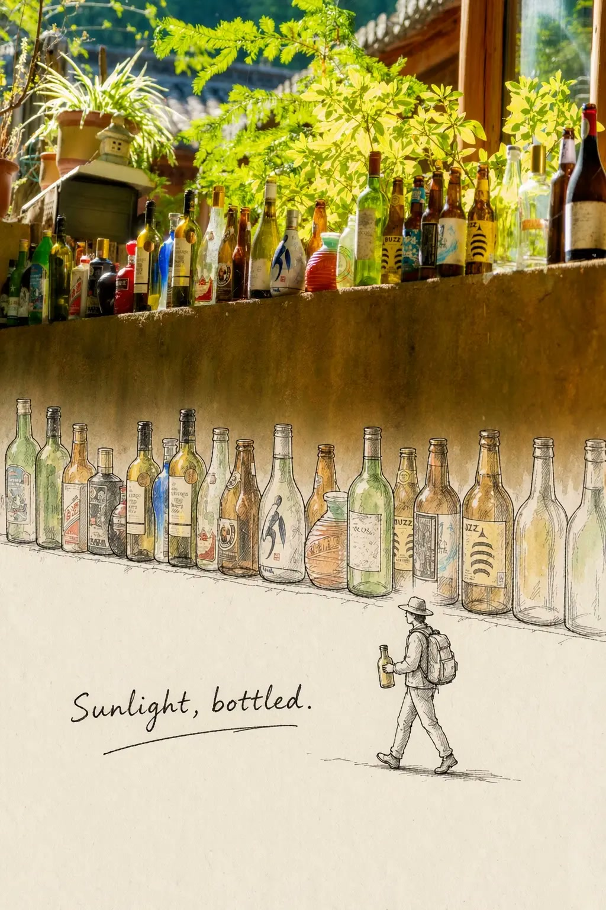

# 真实摄影与钢笔速写旅行手账

[返回完整目录](../../CATALOG.md)



上半部保留照片，下半部转为暖米白纸上的钢笔淡彩，以跨越纸面边界的元素和小旅行者串起故事。

类型：生图 · 来源案例

**旅行城市** 照片编辑 钢笔速写 水彩淡彩 旅行手账

来源：[云中工作室](https://www.douyin.com/video/7692257527824345585)

可替换内容：`[上传一张场景照片，并替换提示词中的场景关键词、画面内容描述、延伸元素、点缀色、要排除的密集内容及小人动作。]`

## 完整提示词

```text
请基于我上传的照片，创作一张富有故事感的“真实摄影+手绘卡通”创意画面，成品为2:3竖版。[场景关键词]照片与钢笔速写融合创意画，竖版构图。上半部分：完整保留原始照片不变——[画面内容描述]；下半部分为暖米白色纸面背景。照片与纸面的过渡要自然：照片底边呈轻微不规则、柔和毛边的手撕纸质感边缘，不要笔直生硬的切割线，也不要大面积雾化渐变。唯一越过边界的元素是[延伸元素]：其上半部分仍为照片质感，下半部分已变为黑色钢笔线描并带[点缀色]水彩淡彩，元素稀疏极简，大面积留白，不要[要排除的密集内容]。画面右下方有一个戴帽子背双肩包的手绘小旅行者，正在[小人动作]。配一条下划线花笔。整体极简、诗意、旅行手账风格。
```

## English Prompt

```text
Based on my uploaded photo, create a storytelling composition combining real photography and hand-drawn cartoons, in a vertical 2:3 format. A creative fusion of a [scene keywords] photo and pen sketch, with a portrait composition. Upper section: preserve the original photograph completely unchanged—[description of the scene]; the lower section has a warm off-white paper background. Make the transition between the photograph and paper natural: the bottom edge of the photo should resemble gently irregular, soft, frayed hand-torn paper, not a straight, rigid cut line or a large misty gradient. The only element crossing the boundary is [extending element]: its upper section remains photographic, while its lower section becomes black pen line art with a light [accent color] watercolor wash. Keep the elements sparse and minimal, with generous negative space, and no [dense content to exclude]. In the lower right, include a small hand-drawn traveler wearing a hat and backpack, [traveler action]. Add a decorative pen-drawn underline. The overall style is minimal, poetic, and reminiscent of a travel journal.
```

[打开 style.json](../../../styles/image/image-photo-pen-sketch-travel-journal/style.json) · [打开条目目录](../../../styles/image/image-photo-pen-sketch-travel-journal/)

<!-- Generated by scripts/build.mjs. -->
