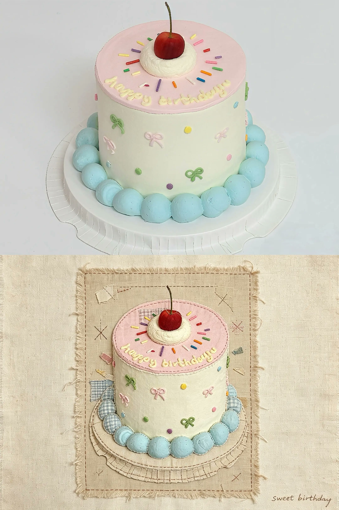

# 复古手工拼布画

[返回完整目录](../../CATALOG.md)



把照片中的景物转成带毛边、缝线和补丁层次的复古布艺拼贴，保留原图构图与物体位置。

类型：生图 · 来源案例

**社交媒体** 照片转绘 布艺拼贴 手工缝线 复古

来源：[Pou妈的AI小匣子](https://www.douyin.com/video/7677900163386912241)

可替换内容：`[上传一张要转换为拼布画的照片。]`

## 完整提示词

```text
帮我把照片编辑为：一幅温暖复古的手工拼布贴画，横版4:3比例。

整张背景为浅米色粗亚麻画布，背景颜色可以根据每张照片的风格颜色做轻微调整。画面中央放置一块细长横向窄长方形布艺拼贴基底（高度占画面的三分之一），基底轮廓不要做成完全规整的矩形，边缘故意撕扯出毛边并带有松散线头。

用格纹棉布、亚麻和水洗粗麻布碎料裁剪成扁平简约形状，还原原图的构图与物体位置，可以有一些不规则的边缘/伸出。每条轮廓线都可见清晰的手工缝纫针迹和轮廓缝线，带有扁平、质朴稚拙的童趣感。增加明显的补丁布片、交叉缝线和碎纸条层次。

画面里的景物元素（树木、屋檐、植被等）不受拼布基底边框限制，允许布片造型向外延伸、探出、突破基底边缘，物体可以跨出拼布区域生长延伸，如同实景穿出画布，不强行把所有物体封闭在长方形边框内。

在拼贴画的空白处加入一句与画面内容相关的英文小字，字母用细线勾勒缝制，属于线迹文字，和整体拼布风格匹配。字体尺寸偏小，位置随机摆放于留白区域，不要遮挡核心景物。
```

## English Prompt

```text
Edit my photo into a warm, vintage handmade patchwork appliqué picture in a horizontal 4:3 aspect ratio.

Use a light beige coarse linen canvas for the entire background. The background color may be adjusted slightly to suit the style and colors of each photo. Place a slim, horizontally elongated rectangular fabric-collage base in the center of the image, occupying one third of the image height. Do not make its outline a perfectly regular rectangle; deliberately tear its edges into frayed borders with loose threads.

Cut scraps of plaid cotton, linen, and washed coarse burlap into flat, simple shapes, reproducing the composition and object positions of the original photo. Some edges or protruding parts may be irregular. Every contour should show clear handmade sewing stitches and outline seams, giving the picture a flat, rustic, childlike, naïve charm. Add noticeable fabric patches, cross-stitching, and layers of torn paper strips.

Scenic elements in the image, such as trees, eaves, and vegetation, are not constrained by the borders of the patchwork base. Allow fabric shapes to extend outward, peek out, and break through the base edges. Objects may grow and extend beyond the patchwork area, as though the real scene were emerging from the canvas. Do not force every object to remain enclosed inside the rectangular border.

Add a short English phrase related to the scene in an empty area of the collage. Outline and sew the letters with fine thread so they are stitch lettering that matches the overall patchwork style. Keep the lettering small and position it randomly within the negative space without obscuring the main scenery.
```

[打开 style.json](../../../styles/image/image-vintage-handmade-patchwork/style.json) · [打开条目目录](../../../styles/image/image-vintage-handmade-patchwork/)

<!-- Generated by scripts/build.mjs. -->
